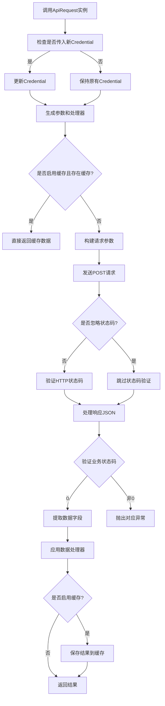
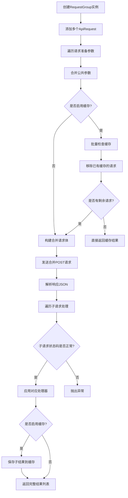

# API 编写指南

## 1. `ApiRequest` 的使用方法

`ApiRequest` 是 QQMusic API 的核心类，用于封装 API 请求。它提供了多种方式来发起请求，以下是几种常见的使用方法：

### 1.1 直接使用 `ApiRequest` 类

你可以直接实例化 `ApiRequest` 类来发起请求。以下是一个简单的示例：

```python
from qqmusicapi.network import ApiRequest
from qqmusicapi.credential import Credential

from typing import Any

async def get_album_detail(album_id: int, credential: Credential):
    req = ApiRequest[[], dict[str, Any]](
        module="music.musichallAlbum.AlbumInfoServer",
        method="GetAlbumDetail",
        params={"albumId": album_id},
        credential=credential,
    )
    response = await req()
    return response
```

在这个示例中，我们创建了一个 `ApiRequest` 实例，指定了模块名、方法名、请求参数和凭证，然后通过 `await req()` 发起请求并获取响应。

### 1.2 使用 `api_request` 装饰器

`api_request` 是一个装饰器，用于简化 API 请求的编写。它可以将一个函数转换为一个返回 `ApiRequest` 实例的函数。以下是一个示例：

```python
from qqmusicapi.network import api_request, NO_PROCESSOR

@api_request("music.musichallAlbum.AlbumInfoServer", "GetAlbumDetail")
async def get_album_detail(value: str | int):
    if isinstance(value, int):
        return {"albumId": value}, NO_PROCESSOR
    return {"albumMId": value}, NO_PROCESSOR
```

在这个示例中，`get_album_detail` 函数被 `api_request` 装饰器修饰，它会自动返回一个 `ApiRequest` 实例。你可以通过 `await get_album_detail(album_id)` 来发起请求。

### 1.3 使用 `RequestGroup` 进行批量请求

`RequestGroup` 用于合并多个 API 请求，支持组级公共参数和重复模块方法处理。以下是一个示例：

```python
from qqmusicapi.network import RequestGroup, ApiRequest

async def get_multiple_album_details(album_ids: list[int], credential: Credential):
    rg = RequestGroup(credential=credential)
    for album_id in album_ids:
        req = ApiRequest(
            module="music.musichallAlbum.AlbumInfoServer",
            method="GetAlbumDetail",
            params={"albumId": album_id},
            credential=credential,
        )
        rg.add_request(req)
    results = await rg.execute()
    return results
```

## 2. 请求流程

### 2.1 `ApiRequest`



### 2.2 `RequestGroup`


