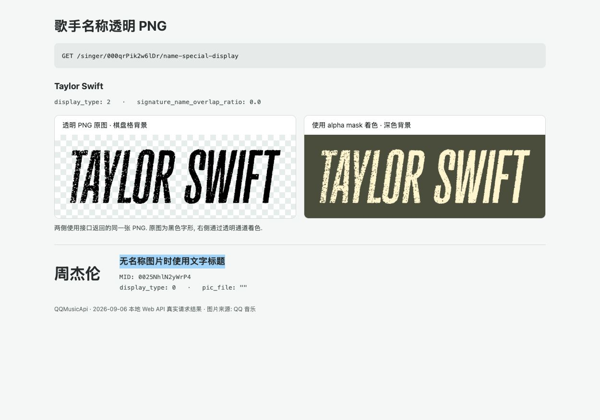

# SingerApi

## 歌手名称透明 PNG

`get_name_special_display(mid)` 获取 QQ 音乐歌手主页的名称展示信息, 无需登录.
当 `display_type == 2` 且 `pic_file` 非空时, 可以展示返回的透明 PNG;
没有名称图片时返回 `display_type == 0` 和空 `pic_file`, 调用方使用 `name` 作为文字标题.

### Python 示例

```python
import asyncio

from qqmusic_api import Client


async def main() -> None:
    async with Client() as client:
        result = await client.singer.get_name_special_display("000qrPik2w6lDr")
        print(result.model_dump_json(indent=2))


asyncio.run(main())
```

仓库中的 `examples/singer_name_special_display.py` 会依次请求 Taylor Swift 和周杰伦,
演示有名称图片和无特殊展示两种结果:

```bash
uv run python examples/singer_name_special_display.py
```

### Web API 示例

[启动 Web 服务](../../tutorial/web.md)后调用:

```bash
curl http://127.0.0.1:8080/singer/000qrPik2w6lDr/name-special-display
```

Taylor Swift 的实际返回示例:

```json
{
  "code": 0,
  "msg": "ok",
  "data": {
    "display_type": 2,
    "pic_file": "https://music-conf-cdn.y.qq.com/ocs/pp/156304/nHL9sa6YST_NPwRy_O0Z4z/38f3fa0ea540cf00a1aef154567f8e88.png",
    "signature_name_overlap_ratio": 0.0,
    "name": "Taylor Swift"
  }
}
```

将 MID 换为周杰伦的 `0025NhlN2yWrP4`, 实际返回示例为:

```json
{
  "code": 0,
  "msg": "ok",
  "data": {
    "display_type": 0,
    "pic_file": "",
    "signature_name_overlap_ratio": 0.0,
    "name": "周杰伦"
  }
}
```

### 图片演示

下图使用上述接口于 2026-09-06 返回的 PNG, 展示原图、使用透明通道着色的效果和无图片时的文字标题.
示例图片为黑色字形, 在深色背景上可将 PNG 作为 alpha mask 着色; PNG 不是字体文件.
Web 使用 CSS mask 时需要同源或支持 CORS 的图片地址, 本演示使用下载后的同源 PNG.
展示信息和图片地址由 QQ 音乐提供, 可能随歌手主页更新而变化.



## API 参考

::: modules.singer.SingerApi
